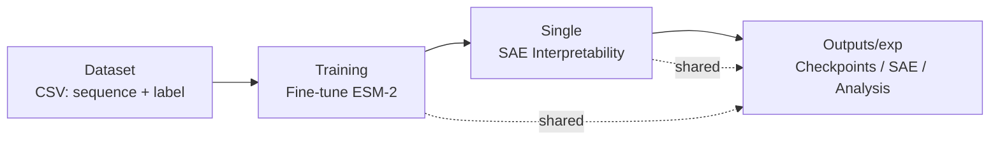

# CrossPLM

<p align="center">
  
  
  
  
  
</p>

**Mechanistic Interpretability for Cross-Task Protein Language Models**

> From sequence to interpretable biology — without hand-written rules.
>
> Protein language models (PLMs) are powerful but opaque. CrossPLM fine-tunes a PLM on *your* per-residue task and then uses **Sparse Autoencoders (SAEs)** to turn the model’s hidden state into sparse, human-readable features — asking not just *what* biology was learned, but whether it is used for predictions and whether it is shared across tasks.

## Why CrossPLM — and why cross-task?

Single-model interpretability — decomposing one fine-tuned PLM into features like *flexibility detectors* or *helix detectors* — has been shown to work (e.g. InterPLM). CrossPLM builds on that foundation but asks the question most relevant to biochemistry:

> **When two PLMs are fine-tuned independently for different biological tasks (e.g. stability vs subcellular localization), do they converge on the same internal biology — and can that shared biology be traced and perturbed across models?**

Concretely, CrossPLM lets you test whether a feature that lights up on a *membrane-associated* region in a stability model also appears in a localization model, whether it predicts the *other* task, and whether steering it in one model changes behavior tied to the other. Computationally this is a sparse feature + probe + intervention problem; biologically it translates to a testable hypothesis such as *“both models reuse a hydrophobic/transmembrane representation”* that you can follow up with mutagenesis or structural inspection.

You do not need to write parsing code for labels — a shared **label map** lets Training and Single interpret raw CSVs identically, so the same residue gets the same label in fine-tuning and in interpretation.

---

## What can you do with CrossPLM?

| Question you have | What CrossPLM gives you | Example (computational → biological read-out) |
|---|---|---|
| *Where does flexibility / disorder come from?* | Ranked SAE features per task, with precision/recall/F1 | Feature #234 — flexibility detector (F1 0.51) → enriched for P/G/S in loop regions |
| *Does the model capture real biology?* | Alignment to Swiss-Prot concepts (helix, kinase domain, binding site) | Feature #42 → `Domain_kinase` (F1 0.62) → suggests a learned kinase-motif representation |
| *Is a feature causal or just correlated — and is it shared?* | Perturbation tests + cross-task probes and feature–feature similarity | Zero Feature #42 → flip rate higher on active residues; the same feature predicts the *other* task — a candidate shared biological computation |

---

## Quick Start

All commands run from the repository root — no `cd` needed.

```bash
pip install -r requirements.txt        # core dependencies
pip install -e .                        # optional: bare `crossplm` command + `single` package
```

```bash
# 1. Fine-tune a PLM on your dataset
python crossplm.py training init   --task_name my_experiment
# → edit Outputs/my_experiment/config.yaml, then:
python crossplm.py training train  --config Outputs/my_experiment/config.yaml

# 2. Open the fine-tuned model with SAEs
python crossplm.py single extract_embeddings  --experiment my_experiment --ckpt_path Outputs/my_experiment/checkpoints/best --sequences_csv Dataset/mBMRB.csv
python crossplm.py single train_sae           --experiment my_experiment
python crossplm.py single analyze_features    --experiment my_experiment --sequences_csv Dataset/mBMRB.csv
```

Prefer forms over flags?

```bash
pip install streamlit pyyaml
streamlit run gui/app.py   # → http://localhost:8501  (visual command builder)
```

---

## How It Works



**Training** fine-tunes a PLM on a *per-residue* classification task — a setting natural for biochemistry because each amino acid gets its own label (e.g. rigid vs flexible, helix/strand/coil, modified vs unmodified). Formally this is token classification. It supports both `facebook/esm2_t6_8M_UR50D` and `Synthyra/ESM2-8M` (FastPLMs, `trust_remote_code=True` handled automatically), writes `provenance.json` + `config_snapshot.yaml` for reproducibility, and offers `freeze_backbone` / `freeze_layers` for controlled experiments (e.g. testing whether a feature is inherited from the pre-trained model). A **label map** translates raw characters (e.g. `A → 0`, `. → 1`) to class IDs so Training and Single never disagree.

**Single** decomposes the model's dense hidden state into a sparse, overcomplete dictionary — each feature is judged by *when* it fires, not by its weight value:

- Fires on **flexible** residues? → a *flexibility detector* (computational: high F1/AUROC; biological: loop/disorder region)
- Fires on **helices** or **kinase domains**? → a *structural/functional* detector, validated against Swiss-Prot concepts
- Is it causally necessary? → perturb (zero / amplify) one feature and measure whether per-residue predictions change

Pipeline: **extract embeddings → train SAE → align to task labels / Swiss-Prot concepts → validate (held-out, fidelity, causal intervention) → visualize.**

> **New to SAEs?** Think of it as learning a dictionary: the model’s 320-dim hidden state is re-expressed as ~640 sparse features, only ~60 active per residue. Sparsity makes each feature more “monosemantic” and therefore easier to name with a biological concept.

**Cross-task extension (the focus of this project):** Single-model features are the *prerequisite*. The scientific contribution is testing whether independently trained task models *share* those features — via feature–feature similarity, cross-task probes (`model A’s features → task B`), and eventually cross-model interventions (see `Crossing/README.md`).

For command-level details see:

- **[Training/README.md](Training/README.md)** — init / train / eval, config fields, label maps, checkpoints, provenance
- **[Single/README.md](Single/README.md)** — full SAE pipeline, outputs, validation
- **[Crossing/README.md](Crossing/README.md)** — cross-model roadmap (Phase 1–2 ready)
- **[gui/README.md](gui/README.md)** — Streamlit command builder

---

## Modules at a Glance

| Module | What it does | Status |
|--------|--------------|--------|
| **[Training](Training/README.md)** | Fine-tune a PLM on your per-residue task (with provenance & freeze controls; native `facebook` + `Synthyra` backbones) | ✅ Ready |
| **[Single](Single/README.md)** | Single-model SAE interpretability — the prerequisite for cross-task analysis (`--model_type base` for `M0` via `Outputs/_pretrained/`, `ft` for `MA/MB`) | ✅ Ready |
| **[Crossing](Crossing/README.md)** | **Core contribution:** cross-model interpretability — do independent tasks share biology? (feature similarity, cross-task probes) | 🚧 Phase 1–2 ready; Phase 0 `M0` via Single, `baseline` script still planned |
| **[GUI](gui/README.md)** | Streamlit UI that builds commands visually (Training + Single + Crossing) | ✅ Ready |

`Outputs/<experiment>/` is the **shared root** for Training and Single: Training writes `config.yaml`, `provenance.json`, checkpoints and `training_curve.png`; Single writes `embeddings/`, `sae/` and `analysis/`. One experiment name = one directory (verbatim, no timestamp).

---

<details>
<summary><b>Repository Layout</b> (click to expand)</summary>

```
CrossPLM/
├── crossplm.py            # Unified CLI:  training | single | crossing
├── setup.py               # pip install -e .  →  `crossplm` command
├── requirements.txt
├── Dataset/               # Raw datasets + label-map YAMLs (user-supplied, gitignored)
├── Training/              # PLM fine-tuning  → README.md
├── Single/                # SAE interpretability → README.md
├── Crossing/              # Cross-model analysis → README.md
├── Outputs/               # Shared experiment outputs (per-experiment)
└── gui/                   # Streamlit command builder → README.md
```

</details>

<details>
<summary><b>Outputs Structure</b></summary>

```
Outputs/
├── _pretrained/<hub-slug>/         # ONE central M0 per backbone (e.g. facebook--esm2_t6_8M_UR50D)
│   └── config.json / model.safetensors / tokenizer* / m0_provenance.json
└── <experiment>/
    ├── config.yaml / config_snapshot.yaml / provenance.json
    ├── training_curve.png / eval_metrics.jsonl
    ├── checkpoints/
    │   ├── best/              # stable alias: highest F1  ← use for Single
    │   ├── epoch_<N>_f1_<F>/  # top-3 by F1
    │   └── final/
    └── <source>/              # per --source (e.g. mbmrb / swissprot)
        ├── embeddings/layer_<N>/shard_*/  # use --model_type base for M0, ft for MA/MB
        ├── sae/model.pt
        └── analysis/*.json|*.csv|visualizations/
```

`--source` lets one experiment hold multiple datasets without overwriting. `--model_type base` (M0, Hub ID) reuses `Outputs/_pretrained/` so `MA`/`MB` with the same backbone share one `M0` copy; `--model_type ft` (default) expects a local `checkpoints/best`.

</details>

<details>
<summary><b>Dependencies</b></summary>

```bash
pip install -r requirements.txt
```

Core: `torch`, `transformers`, `pandas`, `numpy`, `scipy`, `scikit-learn`, `matplotlib`, `PyYAML`, `tqdm`.

</details>

---

## Citation

A manuscript is in preparation. If you use this code, please cite the repository:

```bibtex
@misc{crossplm,
  author       = {Bingwu, Li and collaborators},
  title        = {CrossPLM: Cross-Task Mechanistic Interpretability for Protein Language Models},
  year         = {2026},
  howpublished = {\url{https://github.com/lbwfff/CrossPLM}}
}
```

Please also cite the method this project builds on:

```bibtex
@article{simon2025interplm,
  title={InterPLM: discovering interpretable features in protein language models via sparse autoencoders},
  author={Simon, Elana and Zou, James},
  journal={Nature Methods},
  year={2025},
  doi={10.1038/s41592-025-02836-7},
  url={https://www.nature.com/articles/s41592-025-02836-7}
}
```
